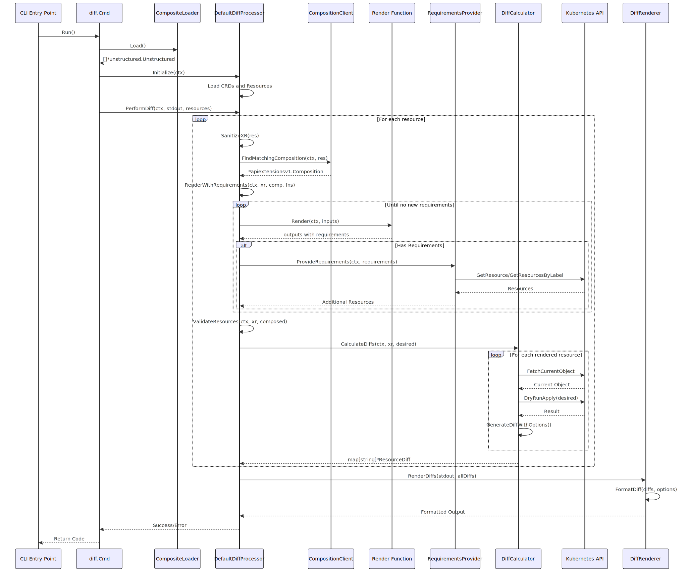

# Crossplane Diff Command - Design Document

## Table of Contents

1. [Introduction](#1-introduction)
2. [Architecture Overview](#2-architecture-overview)
3. [Component Design](#3-component-design)
4. [Key Workflows](#4-key-workflows)
5. [Design Considerations](#5-design-considerations)
6. [Future Enhancements](#6-future-enhancements)
7. [Conclusion](#7-conclusion)
8. [List of Figures](#8-list-of-figures)

## 1. Introduction

### 1.1 Purpose

The Crossplane Diff command extends the Crossplane CLI with functionality to visualize the differences between
Crossplane resources in a YAML file and their resulting state when applied to a live Kubernetes cluster. This is similar
to `kubectl diff` but with specific enhancements for Crossplane resources, particularly Composite Resources (XRs) and 
their composed resources.

### 1.2 Guiding Principles

The design prioritizes the accuracy of the diff above all; we decline to proceed in the case of errors or ambiguity, 
unless that ambiguity is the result of unknowable information (e.g., a dependency in a later pipeline step on the 
`status` of an object rendered in an earlier step which will not be populated until the MR is applied by the provider).

To this end, the design reaches into the cluster _extensively_ for any information that is needed to produce a diff,
including functions, compositions, requirements (including environment configs), current state of the XR and any
downstream resources, and XRDs and CRDs for validation. 

### 1.3 Scope

The Diff command enables users to:

- Preview changes before applying them to a cluster
- Visualize differences at multiple levels: both the XR itself and all downstream composed resources
- Support the full Crossplane composition mechanism, including functions
- Handle resource naming patterns (generateName)
- Detect resources that would be removed

## 2. Architecture Overview

The Crossplane Diff command follows a layered architecture pattern with clear separation of concerns. Each layer has
specific responsibilities and depends only on lower layers.


*Figure 1: Conceptual layers of the Crossplane Diff command architecture and their responsibilities*

### 2.1 Architectural Layers

#### 2.1.1 Command Layer

The top-level layer that handles command-line arguments, flags, and coordinates the execution flow.

**Key Components:**

- `Cmd`: Main command structure that processes arguments and flags
- Help functions: Provides usage instructions to users

**Responsibilities:**

- Command parsing
- Argument validation
- Help text generation
- Entry point coordination

#### 2.1.2 Application Layer

The orchestration layer that initializes the application context and coordinates the overall diff process.

**Key Components:**

- `AppContext`: Holds application-wide dependencies and clients
- `DiffProcessor`: The main component responsible for executing the diff workflow
- `Loader`: Handles loading resources from files or stdin

**Responsibilities:**

- Context management
- Client initialization
- Process coordination
- Resource loading
- Result aggregation

#### 2.1.3 Domain Layer

The business logic layer containing the core diff functionality, resource management, and rendering.

**Key Components:**

- `DiffCalculator`: Computes differences between resources
- `SchemaValidator`: Validates resources against their schemas
- `ResourceManager`: Manages resource-related operations
- `RequirementsProvider`: Resolves requirements for resource rendering
- `DiffRenderer`: Formats and displays diffs
- `Render Function`: Handles resource composition rendering; normally a reference to the `render` package

**Responsibilities:**

- Diff calculation
- Resource rendering
- Resource management
- Schema validation
- Requirement processing
- Diff visualization

#### 2.1.4 Client Layer

The infrastructure access layer that interfaces with Kubernetes and Crossplane.

**Key Components:**

- Kubernetes Clients: `ApplyClient`, `ResourceClient`, `SchemaClient`, `TypeConverter`
- Crossplane Clients: `CompositionClient`, `DefinitionClient`, `EnvironmentClient`, `FunctionClient`,
  `ResourceTreeClient`

**Responsibilities:**

- Kubernetes API interaction
- Crossplane resource access
- Resource conversion
- Type handling
- Server-side apply

#### 2.1.5 External Systems

The actual Kubernetes API server and cluster resources that the command interacts with.

**Responsibilities:**

- Kubernetes API server
- Resources in cluster
- CRDs and schemas


*Figure 2: Clean layered architecture showing the main components in each layer*

### 2.2 Data Flow

The data flow through the system follows these key steps:


*Figure 3: Data flow through the Crossplane Diff command system*

1. **Input Processing**:
    - YAML files or stdin content is loaded and parsed into unstructured resources

2. **Processing**:
    - For each Composite Resource (XR):
        - Find the matching composition
        - Render the XR and composed resources using Crossplane functions
        - Discover and resolve requirements for rendering
        - Validate the rendered resources against schemas
        - Calculate diffs between current and desired states

3. **Output**:
    - Format and display diffs to the console

## 3. Component Design


*Figure 4: DiffProcessor architecture showing its subcomponents and their relationships*

### 3.1 DiffProcessor

The `DiffProcessor` is the central component that coordinates the diff workflow. It uses a dependency injection pattern
with factories for its subcomponents.

#### 3.1.1 Interfaces and Implementation

```go
// DiffProcessor interface for processing resources.
type DiffProcessor interface {
   // PerformDiff processes all resources and produces a diff output
   PerformDiff(ctx context.Context, stdout io.Writer, resources []*un.Unstructured) error
   
   // Initialize loads required resources like CRDs and environment configs
   Initialize(ctx context.Context) error
}
```

The `DefaultDiffProcessor` implements this interface and uses several subcomponents:

- `fnClient`: Handles function-related operations
- `compClient`: Handles composition-related operations
- `schemaValidator`: Validates resources against schemas
- `diffCalculator`: Calculates differences between resources
- `diffRenderer`: Formats and displays diffs
- `requirementsProvider`: Handles requirements for resource rendering

#### 3.1.2 Configuration

The `ProcessorConfig` structure provides configuration options:

- `Namespace`: The namespace for resources
- `Colorize`: Whether to colorize the output
- `Compact`: Whether to show compact diffs
- `Logger`: The logger to use
- `RenderFunc`: The function to use for rendering resources
- `Factories`: Factory functions for creating components

### 3.2 DiffCalculator

The `DiffCalculator` is responsible for calculating differences between resources.

#### 3.2.1 Interfaces and Implementation

```go
// DiffCalculator calculates differences between resources.
type DiffCalculator interface {
   // CalculateDiff computes the diff for a single resource
   CalculateDiff(ctx context.Context, composite *un.Unstructured, desired *un.Unstructured) (*dt.ResourceDiff, error)
   
   // CalculateDiffs computes all diffs for the rendered resources and identifies resources to be removed
   CalculateDiffs(ctx context.Context, xr *cmp.Unstructured, desired render.Outputs) (map[string]*dt.ResourceDiff, error)
   
   // CalculateRemovedResourceDiffs identifies resources that would be removed and calculates their diffs
   CalculateRemovedResourceDiffs(ctx context.Context, xr *un.Unstructured, renderedResources map[string]bool) (map[string]*dt.ResourceDiff, error)
}
```

The `DefaultDiffCalculator` handles:

- Retrieving current resources from the cluster
- Performing dry-run applies to see what would happen
- Generating text-based diffs between resources
- Identifying resources that would be removed

### 3.3 ResourceManager

The `ResourceManager` handles resource-related operations such as fetching current resources and managing ownership
references.


*Figure 8: Resource loading and validation architecture showing how resources are loaded and validated*

#### 3.3.1 Interfaces and Implementation

```go
// ResourceManager handles resource-related operations like fetching, updating owner refs,
// and identifying resources to be removed.
type ResourceManager interface {
   // FetchCurrentObject retrieves the current state of an object from the cluster
   FetchCurrentObject(ctx context.Context, composite *un.Unstructured, desired *un.Unstructured) (*un.Unstructured, bool, error)
   
   // UpdateOwnerRefs ensures all OwnerReferences have valid UIDs
   UpdateOwnerRefs(parent *un.Unstructured, child *un.Unstructured)
}
```

The `DefaultResourceManager` handles:

- Looking up resources by name
- Looking up resources by labels and annotations
- Handling resources with generateName
- Managing owner references

### 3.4 SchemaValidator

The `SchemaValidator` validates resources against their schemas, ensuring they are valid before calculating diffs.

#### 3.4.1 Interfaces and Implementation

```go
// SchemaValidator handles validation of resources against CRD schemas.
type SchemaValidator interface {
   // ValidateResources validates resources using schema validation
   ValidateResources(ctx context.Context, xr *un.Unstructured, composed []cpd.Unstructured) error
   
   // EnsureComposedResourceCRDs ensures we have all required CRDs for validation
   EnsureComposedResourceCRDs(ctx context.Context, resources []*un.Unstructured) error
}
```

The `DefaultSchemaValidator` handles:

- Loading CRDs from the cluster
- Converting XRDs to CRDs
- Validating resources against schemas

### 3.5 RequirementsProvider

The `RequirementsProvider` handles requirements for resource rendering, providing additional resources needed by
Crossplane functions.

#### 3.5.1 Implementation

The `RequirementsProvider` handles:

- Caching frequently used resources
- Fetching resources by name or label selectors
- Converting between resource formats

### 3.6 DiffRenderer

The `DiffRenderer` formats and displays diffs in a human-readable format.


*Figure 6: Diff rendering architecture showing how diffs are formatted and displayed*

#### 3.6.1 Interfaces and Implementation

```go
// DiffRenderer handles rendering diffs to output.
type DiffRenderer interface {
   // RenderDiffs formats and outputs diffs to the provided writer
   RenderDiffs(stdout io.Writer, diffs map[string]*dt.ResourceDiff) error
}
```

The `DefaultDiffRenderer` handles:

- Formatting diffs with colors and context
- Supporting compact mode for large diffs
- Summarizing changes

### 3.7 Kubernetes and Crossplane Clients

The client layer provides interfaces to interact with Kubernetes and Crossplane resources.


*Figure 5: Kubernetes and Crossplane client architecture showing the interfaces and implementations*

#### 3.7.1 Kubernetes Clients

- `ApplyClient`: Handles server-side apply operations
- `ResourceClient`: Handles basic CRUD operations
- `SchemaClient`: Handles schema-related operations
- `TypeConverter`: Handles conversion between Kubernetes types

#### 3.7.2 Crossplane Clients

- `CompositionClient`: Handles composition-related operations
- `DefinitionClient`: Handles definition-related operations
- `EnvironmentClient`: Handles environment-related operations
- `FunctionClient`: Handles function-related operations
- `ResourceTreeClient`: Handles resource tree operations

## 4. Key Workflows


*Figure 7: Call sequence diagram showing the interaction between components during a diff operation*

### 4.1 Diff Workflow

1. The `Cmd` parses arguments and initializes the application context
2. The `Loader` loads resources from files or stdin
3. The `DiffProcessor` initializes and loads required schemas
4. For each resource:
    - The `DiffProcessor` finds the matching composition
    - The `DiffProcessor` renders the resource using the render function
    - The `RequirementsProvider` resolves any requirements
    - The `SchemaValidator` validates the rendered resources
    - The `DiffCalculator` calculates diffs between current and desired states
    - The `DiffRenderer` formats and displays the diffs

### 4.2 Resource Rendering Workflow

1. The `DiffProcessor` calls the render function with the XR and composition
2. The render function executes the composition pipeline:
    - It sets up the initial state with the XR
    - It executes each function in the pipeline
    - It returns the desired state with the XR and composed resources
3. The `DiffProcessor` resolves any requirements and reruns the render function if needed
4. The rendered resources are validated and used for diff calculation

## 5. Design Considerations

### 5.1 Dependency Injection and Inversion of Control

The design uses dependency injection extensively, making the code more testable and modular. Factory functions are used
to create components, allowing for easy customization and testing.

The Diff command leverages the Kong CLI framework's binding mechanisms to implement a sophisticated dependency injection
system. In the `Cmd.AfterApply` method, various components are initialized and then bound to the Kong context:

```go
   ctx.Bind(appCtx) // appCtx is a container that holds refs to all the clients we use for initializing dependencies
   ctx.BindTo(proc, (*dp.DiffProcessor)(nil))
   ctx.BindTo(loader, (*internal.Loader)(nil))
```

This approach allows the command to:

1. Inject different implementations of interfaces for testing
2. Maintain clear boundaries between components
3. Support inversion of control, where higher-level components are not dependent on specific implementations of
   lower-level ones
4. Keep the main execution flow clean by having dependencies provided rather than created inline

The binding mechanism is particularly valuable for CLI commands, as it allows the Run method to receive exactly the
dependencies it needs without having to construct them itself:

```go
// Run executes the diff command.
func (c *Cmd) Run(k *kong.Context, log logging.Logger, appCtx *AppContext, proc dp.DiffProcessor, loader internal.Loader) error { 
	// Implementation that uses the injected dependencies
}
```

This clean separation demonstrates proper inversion of control - the `Run` method depends on abstractions (interfaces)
rather than concrete implementations, and the concrete implementations are provided externally through Kong's binding
mechanism.

### 5.2 Interface-Based Design

Key components are defined as interfaces, allowing for multiple implementations and easier testing.

### 5.3 Caching

Several components use caching to improve performance, particularly for frequently accessed resources.

### 5.4 Error Handling

Errors are propagated up the call stack and wrapped with context to make debugging easier.

### 5.5 Logging

A structured logger is injected throughout the components, allowing for detailed logs with context.

### 5.6 Integration with Existing Crossplane CLI Components

The Diff command has been designed to leverage several existing components from the Crossplane CLI ecosystem, promoting code reuse and maintaining consistency across the Crossplane tooling:

#### 5.6.1 Resource Loading

The command uses a shared `Loader` implementation that has been promoted to the `internal` package, enabling consistent resource loading across different CLI commands:

```go
// Loader interface defines the contract for different input sources.
type Loader interface {
    Load() ([]*unstructured.Unstructured, error)
}
```

This shared loader provides:
- Consistent handling of YAML files, directories, and stdin
- Support for splitting multi-document YAML files
- Extraction of embedded resources from Composition pipeline inputs
- Standardized error handling for resource loading

By reusing this component, the Diff command maintains behavioral consistency with other Crossplane CLI commands that
process YAML resources.

#### 5.6.2 Schema Validation

The command integrates with the schema validation code from the `validate` command:

```go
// Use the validation logic from the validate command
if err := validate.SchemaValidation(ctx, resources, v.crds, true, true, loggerWriter); err != nil {
    return errors.Wrap(err, "schema validation failed")
}
```

This validation:
- Ensures resources conform to their CRD schemas
- Provides consistent validation messages across commands
- Shares the same validation rules as other Crossplane tools
- Reduces code duplication and maintenance burden

#### 5.6.3 Resource Rendering

The Diff command calls the same `render.Render` function used by other components:

```go
// Perform render to get requirements
output, renderErr := p.config.RenderFunc(ctx, p.config.Logger, render.Inputs{
    CompositeResource: xr,
    Composition:       comp,
    Functions:         fns,
    ExtraResources:    renderResources,
})
```

This shared rendering functionality:
- Ensures consistent composition processing
- Handles the same function execution pipeline as Crossplane itself
- Processes requirements consistently
- Maintains compatibility with the Crossplane rendering mechanism

#### 5.6.4 Resource Tree Evaluation

The Diff command leverages the resource tree evaluation capability from the `trace` command:

```go
// Try to get the resource tree
resourceTree, err := c.treeClient.GetResourceTree(ctx, xr)
```

This shared functionality:
- Traverses resource relationships consistently
- Identifies composed resources with the same logic as other commands
- Uses the same parent-child relationship model
- Enables accurate identification of resources to be removed

#### 5.6.5 Benefits of Component Reuse

Leveraging these existing components provides several advantages:

1. **Consistency**: Ensures the Diff command behaves consistently with other Crossplane tools
2. **Maintainability**: Reduces duplication and centralizes fixes in shared components
3. **Reliability**: Utilizes battle-tested code paths that are already in use
4. **Development Efficiency**: Accelerates development by building on existing foundations
5. **Feature Parity**: Ensures that improvements to shared components benefit multiple commands

This approach of building on existing components aligns with software engineering best practices of code reuse and
modular design, while ensuring the Diff command integrates seamlessly into the broader Crossplane CLI ecosystem.

#### 5.6.6 Modifications to Existing Components and Integration Challenges

While leveraging existing components provides numerous benefits, it also required some modifications to ensure they meet
the needs of the Diff command:

##### Modified Render Output Contract

The most significant change was the alteration of the `render.Outputs` structure to add `Requirements` as a member:

```go
// Outputs contains all outputs from the render process.
type Outputs struct {
    // the rendered xr
    CompositeResource *ucomposite.Unstructured
    // the rendered mrs derived from the xr
    ComposedResources []composed.Unstructured
    // the Function results (not render results)
    Results []unstructured.Unstructured
    // the Crossplane context object
    Context *unstructured.Unstructured
    // the Function requirements - Added for Diff command
    Requirements map[string]fnv1.Requirements
}
```

This change was necessary to support the iterative requirements discovery process in the Diff command, which needs to:
1. Capture requirements from the render process
2. Resolve those requirements
3. Re-render with the resolved requirements
4. Detect when no new requirements are needed

This modification required coordination with the maintainers of the `render` package to ensure backward compatibility
while adding this functionality.

##### Render Iterative Requirements Loop

The Diff command needed to implement an iterative requirements discovery process that wasn't previously needed in other
commands. This required developing a new pattern to handle the discovery and resolution of requirements:

```go
// RenderWithRequirements performs an iterative rendering process that discovers and fulfills requirements.
func (p *DefaultDiffProcessor) RenderWithRequirements(
    ctx context.Context,
    xr *cmp.Unstructured,
    comp *apiextensionsv1.Composition,
    fns []pkgv1.Function,
    resourceID string,
) (render.Outputs, error) {
    // Start with environment configs as baseline extra resources
    var renderResources []un.Unstructured
    
    // Track resources we've already discovered to detect when we're done
    discoveredResourcesMap := make(map[string]bool)
    
    // Set up for iterative discovery
    const maxIterations = 10 // Prevent infinite loops
    var lastOutput render.Outputs
    var lastRenderErr error
    
    // Iteratively discover and fetch resources until we have all requirements
    for iteration := 0; iteration < maxIterations; iteration++ {
        // Perform render to get requirements
        output, renderErr := p.config.RenderFunc(ctx, p.config.Logger, render.Inputs{...})
        
        // Process requirements and check if we need to continue iterating
        // ...
    }
    
    return lastOutput, lastRenderErr
}
```

This implementation pattern may be valuable to extract into a shared utility if other commands need similar requirements
discovery capabilities in the future.

##### Client Abstraction Layer

The Diff command required a more abstract client layer to facilitate testing and to properly separate concerns. This led
to the development of the client interfaces and implementations described in previous sections. These abstractions could
potentially be moved to a shared location for use by other commands that need similar capabilities.

##### Build Challenges

The unit tests for this command follow the existing patterns for Crossplane CLI commands, and there are some valuable
e2e tests due to the level of interaction with a real cluster, but the Diff command adds an intermediary layer of
integration testing built on kubernetes `envtest`. This is much faster and more robust than running the related e2es,
but it does require a bit of extra setup:  not least, it requires docker to be accessible at `go test` time, which
requires us to use the `WITH DOCKER` command in Earthly.  This requires privileged access, so as it stands the unit
tests must be run in privileged mode with `-P`.  At the very least, this has ripple effects in documentation, if not 
also CI and/or any security implications.

## 6. Future Enhancements

Several potential enhancements could be made to the Diff command:

1. **File Output**: Add support for writing diffs to a file
2. **Diff Against Composition Revisions**: Support diffing against a new version of a composition
3. **Diff Against Unreleased Components**: Support diffing against upgraded schemas or compositions that aren't yet
   applied
4. **Selective Diff**: Allow diffing only specific resources or resource types
5. **Crank Refactoring**: Several commands have similar code for loading resources and/or initializing kubernetes
    clients.  It would be valuable to refactor this code into a shared package to reduce duplication and improve
    maintainability.

## 7. Conclusion

The Crossplane Diff command provides a powerful tool for visualizing changes to Crossplane resources before they are
applied to a cluster. The layered architecture with clear separation of concerns makes the code modular, testable, and
maintainable.

The extensive use of interfaces and dependency injection allows for easy customization and testing. The caching
mechanisms improve performance for frequently accessed resources.

Overall, the design provides a solid foundation for the Diff command and allows for future enhancements to improve
usability and functionality.

## 8. List of Figures

1. Figure 1: Conceptual layers of the Crossplane Diff command architecture and their responsibilities
2. Figure 2: Clean layered architecture showing the main components in each layer
3. Figure 3: Data flow through the Crossplane Diff command system
4. Figure 4: DiffProcessor architecture showing its subcomponents and their relationships
5. Figure 5: Kubernetes and Crossplane client architecture showing the interfaces and implementations
6. Figure 6: Diff rendering architecture showing how diffs are formatted and displayed
7. Figure 7: Call sequence diagram showing the interaction between components during a diff operation
8. Figure 8: Resource loading and validation architecture showing how resources are loaded and validated